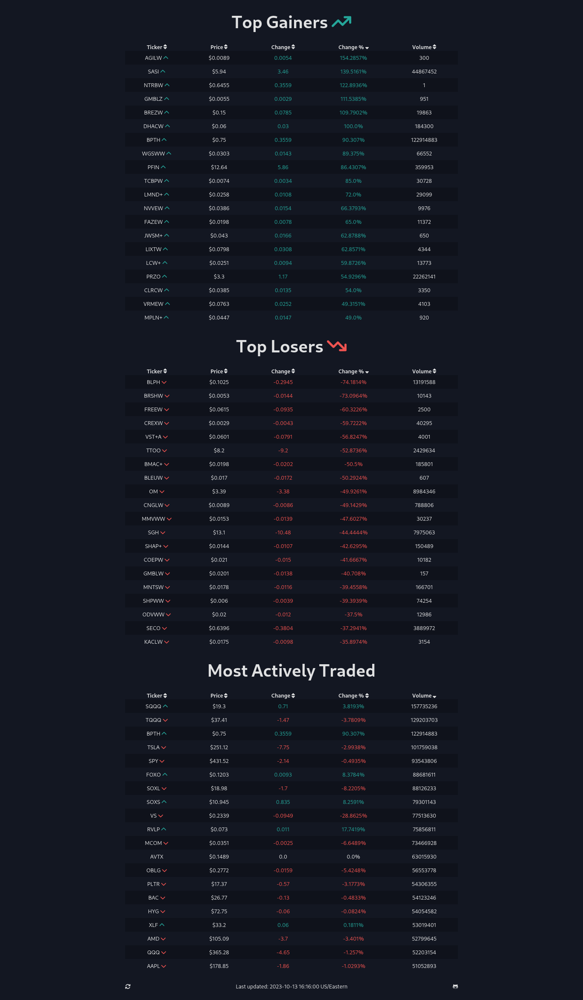

# Top Gainers and Losers

A simple Vue.js project that displays data for the top gainers, top losers, and most actively traded stocks. The project uses the Vue 3 Composition API, Vite for bundling and local server, and Sass for styling.

## Table of Contents

- [Features](#features)
- [Installation](#installation)
- [Usage](#usage)
- [Screenshots](#screenshots)

## Features

- Displays data for top gainers, top losers, and most actively traded stocks.
- Sort columns by clicking on table headers.
- Numeric and alphanumeric sorting support.
- Real-time data updates.
- Stylish user interface using Sass.

## Installation

To get started with this project, follow these steps:

1. Clone this repository:

   ```bash
   git clone https://github.com/dreamxinxcode/top-gainers-and-losers.git
   cd top-gainers-and-losers
   ```

2. Install dependencies using npm or yarn:
   ```bash
   npm install
   # or
   yarn install
   ```
3. Start the development server:
   ```bash
   npm run dev
   # or
   yarn dev
   ```
4. Open your browser and navigate to http://localhost:5173

## Screenshots
